# Dependency Graph & Complexity Analysis

## 1. Top-Level Module Dependency Graph

```mermaid
graph LR
  QueryEngine.ts --> bootstrap
  QueryEngine.ts --> entrypoints
  QueryEngine.ts --> services
  QueryEngine.ts --> commands.js
  QueryEngine.ts --> constants
  QueryEngine.ts --> cost-tracker.js
  QueryEngine.ts --> hooks
  QueryEngine.ts --> memdir
  QueryEngine.ts --> query.js
  QueryEngine.ts --> state
  QueryEngine.ts --> Tool.js
  QueryEngine.ts --> tools
  QueryEngine.ts --> types
  QueryEngine.ts --> utils
  Task.ts --> state
  Task.ts --> types
  Task.ts --> utils
  Tool.ts --> commands.js
  Tool.ts --> hooks
  Tool.ts --> utils
  Tool.ts --> context
  Tool.ts --> services
  Tool.ts --> tools
  Tool.ts --> types
  Tool.ts --> components
  Tool.ts --> constants
  Tool.ts --> entrypoints
  Tool.ts --> state
  assistant --> constants
  assistant --> entrypoints
  assistant --> utils
  bootstrap --> entrypoints
  bootstrap --> tools
  bootstrap --> types
  bootstrap --> utils
  bridge --> constants
  bridge --> utils
  bridge --> services
  bridge --> entrypoints
  bridge --> types
  bridge --> ink
  bridge --> bootstrap
  bridge --> cli
  buddy --> hooks
  buddy --> ink
  buddy --> ink.js
  buddy --> state
  buddy --> utils
  buddy --> types
  buddy --> context
  cli --> tools
  cli --> utils
  cli --> commands
  cli --> services
  cli --> components
  cli --> ink.js
  cli --> keybindings
  cli --> state
  cli --> bootstrap
  cli --> types
  cli --> hooks
  cli --> commands.js
  cli --> Tool.js
  cli --> tools.js
  cli --> QueryEngine.js
  cli --> entrypoints
  cli --> bridge
  cli --> constants
  cli --> tasks
  cli --> memdir
  commands --> bootstrap
  commands --> commands.js
  commands --> components
  commands --> ink.js
  commands --> types
  commands --> utils
  commands --> Tool.js
  commands --> tools.js
  commands --> services
  commands --> bridge
  commands --> context
  commands --> keybindings
  commands --> state
  commands --> tools
  commands --> constants
  commands --> context.js
  commands --> hooks
  commands --> ink
  commands --> skills
  commands --> tasks
  commands --> cost-tracker.js
  commands --> screens
  commands --> projectOnboardingState.js
  commands --> cli
  commands --> plugins
  commands --> voice
  commands.ts --> commands
  commands.ts --> utils
  commands.ts --> skills
  commands.ts --> plugins
  commands.ts --> types
  components --> ink.js
  components --> utils
  components --> context
  components --> state
  components --> services
  components --> hooks
  components --> ink
  components --> types
  components --> tools
  components --> bootstrap
  components --> bridge
  components --> constants
  components --> keybindings
  components --> screens
  components --> cli
  components --> tasks
  components --> commands.js
  components --> memdir
  components --> history.js
  components --> projectOnboardingState.js
  components --> voice
  components --> Tool.js
  components --> commands
  components --> buddy
  components --> tools.js
  components --> cost-tracker.js
  components --> context.js
  components --> entrypoints
  components --> skills
  components --> coordinator
  components --> Task.js
  constants --> utils
  constants --> outputStyles
  constants --> bootstrap
  constants --> tools
  constants --> Tool.js
  constants --> types
  constants --> commands.js
  constants --> services
  constants --> memdir
  context --> ink.js
  context --> utils
  context --> ink
  context --> state
  context --> components
  context.ts --> bootstrap
  context.ts --> constants
  context.ts --> utils
  coordinator --> constants
  coordinator --> services
  coordinator --> tools
  coordinator --> utils
  cost-tracker.ts --> bootstrap
  cost-tracker.ts --> entrypoints
  cost-tracker.ts --> services
  cost-tracker.ts --> utils
  costHook.ts --> cost-tracker.js
  costHook.ts --> utils
  dialogLaunchers.tsx --> assistant
  dialogLaunchers.tsx --> context
  dialogLaunchers.tsx --> ink.js
  dialogLaunchers.tsx --> interactiveHelpers.js
  dialogLaunchers.tsx --> keybindings
  dialogLaunchers.tsx --> state
  dialogLaunchers.tsx --> tools
  dialogLaunchers.tsx --> utils
  entrypoints --> utils
  entrypoints --> bootstrap
  entrypoints --> services
  entrypoints --> state
  entrypoints --> commands
  entrypoints --> commands.js
  entrypoints --> Tool.js
  entrypoints --> tools.js
  history.ts --> bootstrap
  history.ts --> utils
  hooks --> utils
  hooks --> components
  hooks --> native-ts
  hooks --> services
  hooks --> types
  hooks --> context
  hooks --> bootstrap
  hooks --> state
  hooks --> ink.js
  hooks --> tasks
  hooks --> Tool.js
  hooks --> tools
  hooks --> bridge
  hooks --> ink
  hooks --> history.js
  hooks --> assistant
  hooks --> remote
  hooks --> keybindings
  hooks --> screens
  hooks --> server
  hooks --> constants
  hooks --> tools.js
  hooks --> commands.js
  hooks --> entrypoints
  hooks --> ssh
  hooks --> Task.js
  hooks --> commands
  hooks --> vim
  hooks --> voice
  ink --> bootstrap
  ink --> utils
  ink --> native-ts
  ink.ts --> components
  ink.ts --> ink
  interactiveHelpers.tsx --> services
  interactiveHelpers.tsx --> utils
  interactiveHelpers.tsx --> bootstrap
  interactiveHelpers.tsx --> commands.js
  interactiveHelpers.tsx --> context
  interactiveHelpers.tsx --> context.js
  interactiveHelpers.tsx --> entrypoints
  interactiveHelpers.tsx --> ink
  interactiveHelpers.tsx --> ink.js
  interactiveHelpers.tsx --> keybindings
  interactiveHelpers.tsx --> main.js
  interactiveHelpers.tsx --> state
  keybindings --> ink.js
  keybindings --> context
  keybindings --> ink
  keybindings --> utils
  keybindings --> services
  main.tsx --> utils
  main.tsx --> constants
  main.tsx --> context.js
  main.tsx --> entrypoints
  main.tsx --> history.js
  main.tsx --> ink.js
  main.tsx --> replLauncher.js
  main.tsx --> services
  main.tsx --> Tool.js
  main.tsx --> tools
  main.tsx --> tools.js
  main.tsx --> bootstrap
  main.tsx --> commands.js
  main.tsx --> context
  main.tsx --> dialogLaunchers.js
  main.tsx --> ink
  main.tsx --> interactiveHelpers.js
  main.tsx --> plugins
  main.tsx --> skills
  main.tsx --> types
  main.tsx --> commands
  main.tsx --> migrations
  main.tsx --> remote
  main.tsx --> server
  main.tsx --> state
  memdir --> utils
  memdir --> bootstrap
  memdir --> services
  memdir --> tools
  migrations --> services
  migrations --> utils
  migrations --> bootstrap
  native-ts --> ink
  native-ts --> utils
  outputStyles --> constants
  outputStyles --> utils
  plugins --> commands.js
  plugins --> skills
  plugins --> types
  plugins --> utils
  projectOnboardingState.ts --> utils
  query --> bootstrap
  query --> services
  query --> types
  query --> utils
  query --> keybindings
  query --> memdir
  query --> Tool.js
  query --> constants
  query.ts --> hooks
  query.ts --> services
  query.ts --> utils
  query.ts --> Tool.js
  query.ts --> types
  query.ts --> tools
  query.ts --> constants
  query.ts --> query
  query.ts --> bootstrap
  remote --> entrypoints
  remote --> utils
  remote --> constants
  remote --> Tool.js
  remote --> types
  replLauncher.tsx --> context
  replLauncher.tsx --> ink.js
  replLauncher.tsx --> screens
  replLauncher.tsx --> state
  replLauncher.tsx --> utils
  schemas --> entrypoints
  schemas --> utils
  screens --> components
  screens --> utils
  screens --> bootstrap
  screens --> commands.js
  screens --> hooks
  screens --> ink.js
  screens --> keybindings
  screens --> state
  screens --> types
  screens --> ink
  screens --> context
  screens --> services
  screens --> tasks
  screens --> server
  screens --> ssh
  screens --> moreright
  screens --> constants
  screens --> context.js
  screens --> cost-tracker.js
  screens --> costHook.js
  screens --> history.js
  screens --> Tool.js
  screens --> tools
  screens --> query.js
  screens --> projectOnboardingState.js
  screens --> tools.js
  screens --> commands
  screens --> cli
  screens --> buddy
  screens --> remote
  server --> utils
  server --> entrypoints
  server --> remote
  services --> Task.js
  services --> tasks
  services --> tools
  services --> types
  services --> utils
  services --> Tool.js
  services --> bootstrap
  services --> state
  services --> constants
  services --> context.js
  services --> hooks
  services --> context
  services --> cost-tracker.js
  services --> entrypoints
  services --> memdir
  services --> commands.js
  services --> components
  services --> ink.js
  services --> keybindings
  services --> ink
  services --> plugins
  services --> commands
  services --> tools.js
  setup.ts --> services
  setup.ts --> utils
  setup.ts --> bootstrap
  setup.ts --> commands.js
  setup.ts --> types
  skills --> tools
  skills --> utils
  skills --> keybindings
  skills --> memdir
  skills --> services
  skills --> Tool.js
  skills --> types
  skills --> bootstrap
  state --> context
  state --> hooks
  state --> utils
  state --> bridge
  state --> commands.js
  state --> services
  state --> Tool.js
  state --> tasks
  state --> tools
  state --> types
  state --> bootstrap
  state --> Task.js
  tasks --> services
  tasks --> Task.js
  tasks --> utils
  tasks --> types
  tasks --> tools
  tasks --> bootstrap
  tasks --> constants
  tasks --> state
  tasks --> Tool.js
  tasks --> query.js
  tasks --> entrypoints
  tasks --> tasks.js
  tasks.ts --> Task.js
  tasks.ts --> tasks
  tools --> Tool.js
  tools --> types
  tools --> utils
  tools --> bootstrap
  tools --> constants
  tools --> coordinator
  tools --> services
  tools --> tasks
  tools --> tools.js
  tools --> components
  tools --> ink.js
  tools --> memdir
  tools --> state
  tools --> hooks
  tools --> commands.js
  tools --> context.js
  tools --> query.js
  tools --> keybindings
  tools --> bridge
  tools --> voice
  tools --> skills
  tools --> ink
  tools --> Task.js
  tools.ts --> Tool.js
  tools.ts --> tools
  tools.ts --> utils
  tools.ts --> constants
  types --> hooks
  types --> services
  types --> Tool.js
  types --> utils
  types --> entrypoints
  types --> state
  types --> skills
  types --> ink.js
  upstreamproxy --> utils
  utils --> ink
  utils --> services
  utils --> bootstrap
  utils --> Task.js
  utils --> types
  utils --> constants
  utils --> commands.js
  utils --> context.js
  utils --> skills
  utils --> Tool.js
  utils --> tools
  utils --> tools.js
  utils --> hooks
  utils --> state
  utils --> tasks
  utils --> entrypoints
  utils --> memdir
  utils --> buddy
  utils --> components
  utils --> ink.js
  utils --> keybindings
  utils --> cost-tracker.js
  utils --> query.js
  utils --> history.js
  utils --> commands
  utils --> plugins
  utils --> schemas
  vim --> utils
  voice --> services
  voice --> utils
```

### Coupling Metrics

| Module | Outgoing Deps | Incoming Deps | Total Coupling |
|--------|---------------|---------------|----------------|
| utils | 27 | 49 | 76 |
| services | 23 | 27 | 50 |
| tools | 23 | 20 | 43 |
| hooks | 29 | 13 | 42 |
| components | 31 | 10 | 41 |
| commands | 26 | 9 | 35 |
| screens | 30 | 4 | 34 |
| types | 8 | 25 | 33 |
| state | 12 | 20 | 32 |
| bootstrap | 4 | 26 | 30 |
| constants | 9 | 21 | 30 |
| entrypoints | 8 | 18 | 26 |
| main.tsx | 25 | 0 | 25 |
| cli | 20 | 4 | 24 |
| tasks | 12 | 10 | 22 |
| Tool.js | 0 | 20 | 20 |
| context | 5 | 13 | 18 |
| ink | 3 | 15 | 18 |
| keybindings | 5 | 12 | 17 |
| commands.js | 0 | 17 | 17 |
| skills | 8 | 8 | 16 |
| ink.js | 0 | 16 | 16 |
| QueryEngine.ts | 14 | 0 | 14 |
| bridge | 8 | 6 | 14 |
| memdir | 4 | 9 | 13 |
| interactiveHelpers.tsx | 12 | 0 | 12 |
| Tool.ts | 11 | 0 | 11 |
| buddy | 7 | 3 | 10 |
| tools.js | 0 | 10 | 10 |
| plugins | 4 | 5 | 9 |
| query | 8 | 1 | 9 |
| query.ts | 9 | 0 | 9 |
| remote | 5 | 4 | 9 |
| dialogLaunchers.tsx | 8 | 0 | 8 |
| context.js | 0 | 8 | 8 |
| Task.js | 0 | 8 | 8 |
| cost-tracker.js | 0 | 7 | 7 |
| coordinator | 4 | 2 | 6 |
| server | 3 | 3 | 6 |
| voice | 2 | 4 | 6 |
| assistant | 3 | 2 | 5 |
| commands.ts | 5 | 0 | 5 |
| replLauncher.tsx | 5 | 0 | 5 |
| setup.ts | 5 | 0 | 5 |
| query.js | 0 | 5 | 5 |
| history.js | 0 | 5 | 5 |
| cost-tracker.ts | 4 | 0 | 4 |
| migrations | 3 | 1 | 4 |
| native-ts | 2 | 2 | 4 |
| tools.ts | 4 | 0 | 4 |
| Task.ts | 3 | 0 | 3 |
| context.ts | 3 | 0 | 3 |
| outputStyles | 2 | 1 | 3 |
| schemas | 2 | 1 | 3 |
| projectOnboardingState.js | 0 | 3 | 3 |
| costHook.ts | 2 | 0 | 2 |
| history.ts | 2 | 0 | 2 |
| ink.ts | 2 | 0 | 2 |
| tasks.ts | 2 | 0 | 2 |
| vim | 1 | 1 | 2 |
| interactiveHelpers.js | 0 | 2 | 2 |
| ssh | 0 | 2 | 2 |
| moreright | 0 | 1 | 1 |
| projectOnboardingState.ts | 1 | 0 | 1 |
| upstreamproxy | 1 | 0 | 1 |
| QueryEngine.js | 0 | 1 | 1 |
| main.js | 0 | 1 | 1 |
| replLauncher.js | 0 | 1 | 1 |
| dialogLaunchers.js | 0 | 1 | 1 |
| costHook.js | 0 | 1 | 1 |
| tasks.js | 0 | 1 | 1 |

## 2. Complexity Hotspots

Estimated cyclomatic complexity per file (decision points: if, else, switch, case, for, while, &&, ||, ?:, catch, ternary)

| File | Complexity | Lines | Functions | Density | Per-Fn |
|------|-----------|-------|-----------|---------|--------|
| utils/bash/bashParser.ts | 1528 | 4437 | 87 | 0.344 | 17.6 |
| screens/REPL.tsx | 949 | 5006 | 225 | 0.190 | 4.2 |
| main.tsx | 880 | 4684 | 111 | 0.188 | 7.9 |
| cli/print.ts | 856 | 5595 | 100 | 0.153 | 8.6 |
| utils/messages.ts | 819 | 5513 | 164 | 0.149 | 5.0 |
| utils/sessionStorage.ts | 796 | 5106 | 149 | 0.156 | 5.3 |
| utils/bash/ast.ts | 659 | 2680 | 26 | 0.246 | 25.3 |
| utils/hooks.ts | 593 | 5023 | 84 | 0.118 | 7.1 |
| components/LogSelector.tsx | 541 | 1575 | 53 | 0.343 | 10.2 |
| native-ts/yoga-layout/index.ts | 500 | 2579 | 45 | 0.194 | 11.1 |
| services/api/claude.ts | 495 | 3420 | 56 | 0.145 | 8.8 |
| commands/plugin/ManagePlugins.tsx | 493 | 2215 | 62 | 0.223 | 8.0 |
| services/mcp/client.ts | 471 | 3349 | 95 | 0.141 | 5.0 |
| utils/attachments.ts | 459 | 3998 | 94 | 0.115 | 4.9 |
| commands/insights.ts | 448 | 3201 | 65 | 0.140 | 6.9 |
| components/PromptInput/PromptInput.tsx | 420 | 2339 | 91 | 0.180 | 4.6 |
| bridge/bridgeMain.ts | 415 | 3000 | 48 | 0.138 | 8.6 |
| tools/BashTool/bashSecurity.ts | 393 | 2593 | 38 | 0.152 | 10.3 |
| services/mcp/auth.ts | 388 | 2466 | 38 | 0.157 | 10.2 |
| utils/plugins/pluginLoader.ts | 375 | 3303 | 59 | 0.114 | 6.4 |
| tools/BashTool/bashPermissions.ts | 341 | 2622 | 41 | 0.130 | 8.3 |
| components/permissions/rules/PermissionRuleList.tsx | 339 | 1179 | 36 | 0.288 | 9.4 |
| components/mcp/ElicitationDialog.tsx | 337 | 1169 | 49 | 0.288 | 6.9 |
| utils/bash/commands.ts | 327 | 1340 | 26 | 0.244 | 12.6 |
| services/tools/toolExecution.ts | 325 | 1746 | 18 | 0.186 | 18.1 |
| utils/auth.ts | 325 | 2003 | 87 | 0.162 | 3.7 |
| components/Settings/Config.tsx | 322 | 1822 | 52 | 0.177 | 6.2 |
| services/api/errors.ts | 318 | 1208 | 22 | 0.263 | 14.5 |
| hooks/useTypeahead.tsx | 307 | 1385 | 33 | 0.222 | 9.3 |
| utils/collapseReadSearch.ts | 291 | 1110 | 28 | 0.262 | 10.4 |
| components/messages/SystemTextMessage.tsx | 283 | 827 | 14 | 0.342 | 20.2 |
| utils/plugins/marketplaceManager.ts | 272 | 2644 | 45 | 0.103 | 6.0 |
| components/tasks/RemoteSessionDetailDialog.tsx | 269 | 904 | 15 | 0.298 | 17.9 |
| utils/permissions/permissionSetup.ts | 268 | 1533 | 42 | 0.175 | 6.4 |
| commands/plugin/PluginSettings.tsx | 259 | 1072 | 39 | 0.242 | 6.6 |
| ink/render-node-to-output.ts | 256 | 1463 | 24 | 0.175 | 10.7 |
| bridge/replBridge.ts | 255 | 2407 | 44 | 0.106 | 5.8 |
| utils/Cursor.ts | 248 | 1531 | 14 | 0.162 | 17.7 |
| tools/BashTool/pathValidation.ts | 245 | 1304 | 24 | 0.188 | 10.2 |
| types/generated/events_mono/claude_code/v1/claude_code_internal_event.ts | 238 | 866 | 7 | 0.275 | 34.0 |
| ink/ink.tsx | 236 | 1723 | 18 | 0.137 | 13.1 |
| services/mcp/config.ts | 231 | 1579 | 39 | 0.146 | 5.9 |
| components/MessageSelector.tsx | 228 | 831 | 25 | 0.274 | 9.1 |
| services/compact/compact.ts | 228 | 1706 | 28 | 0.134 | 8.1 |
| components/Message.tsx | 224 | 627 | 5 | 0.357 | 44.8 |
| components/permissions/AskUserQuestionPermissionRequest/AskUserQuestionPermissionRequest.tsx | 220 | 645 | 24 | 0.341 | 9.2 |
| components/CustomSelect/select.tsx | 219 | 690 | 33 | 0.317 | 6.6 |
| query.ts | 219 | 1730 | 5 | 0.127 | 43.8 |
| components/agents/AgentsMenu.tsx | 217 | 800 | 20 | 0.271 | 10.8 |
| tools/AgentTool/AgentTool.tsx | 217 | 1398 | 14 | 0.155 | 15.5 |

## 3. Most Complex Functions

Functions with highest estimated complexity (decision points within function body)

| Function | File | Complexity | Lines |
|----------|------|-----------|-------|
| `parseWord` | utils/bash/bashParser.ts | 123 | 330 |
| `PromptInputHelpMenu` | components/PromptInput/PromptInputHelpMenu.tsx | 106 | 336 |
| `BackgroundTask` | components/tasks/BackgroundTask.tsx | 104 | 328 |
| `PluginOptionsDialog` | commands/plugin/PluginOptionsDialog.tsx | 103 | 293 |
| `BridgeDialog` | components/BridgeDialog.tsx | 103 | 323 |
| `DiffDialog` | components/diff/DiffDialog.tsx | 103 | 316 |
| `AssistantToolUseMessage` | components/messages/AssistantToolUseMessage.tsx | 103 | 260 |
| `UltraplanSessionDetail` | components/tasks/RemoteSessionDetailDialog.tsx | 101 | 331 |
| `ConfirmStep` | components/agents/new-agent-creation/wizard-steps/ConfirmStep.tsx | 100 | 330 |
| `InProcessTeammateDetailDialog` | components/tasks/InProcessTeammateDetailDialog.tsx | 98 | 241 |
| `OAuthStatusMessage` | components/ConsoleOAuthFlow.tsx | 94 | 284 |
| `GlimmerMessage` | components/Spinner/GlimmerMessage.tsx | 90 | 305 |
| `UserTextMessage` | components/messages/UserTextMessage.tsx | 87 | 246 |
| `TreeSelect` | components/ui/TreeSelect.tsx | 87 | 281 |
| `PermissionPrompt` | components/permissions/PermissionPrompt.tsx | 85 | 282 |
| `tryParseRedirect` | utils/bash/bashParser.ts | 84 | 237 |
| `ShellDetailDialog` | components/tasks/ShellDetailDialog.tsx | 83 | 248 |
| `MessageRowImpl` | components/MessageRow.tsx | 82 | 195 |
| `AsyncAgentDetailDialog` | components/tasks/AsyncAgentDetailDialog.tsx | 81 | 204 |
| `TaskOutputResultDisplay` | tools/TaskOutputTool/TaskOutputTool.tsx | 80 | 230 |
| `ThemePicker` | components/ThemePicker.tsx | 77 | 299 |
| `DiffDetailView` | components/diff/DiffDetailView.tsx | 77 | 256 |
| `TeammateSpinnerTree` | components/Spinner/TeammateSpinnerTree.tsx | 76 | 182 |
| `SkillPermissionRequest` | components/permissions/SkillPermissionRequest/SkillPermissionRequest.tsx | 76 | 343 |
| `ReviewSessionDetail` | components/tasks/RemoteSessionDetailDialog.tsx | 76 | 267 |
| `ClaudeInChromeMenu` | commands/chrome/chrome.tsx | 74 | 238 |
| `ApiKeyStep` | commands/install-github-app/ApiKeyStep.tsx | 74 | 213 |
| `FallbackPermissionRequest` | components/permissions/FallbackPermissionRequest.tsx | 74 | 317 |
| `BridgeDisconnectDialog` | commands/bridge/bridge.tsx | 73 | 270 |
| `AssistantTextMessage` | components/messages/AssistantTextMessage.tsx | 73 | 223 |
| `DreamDetailDialog` | components/tasks/DreamDetailDialog.tsx | 73 | 223 |
| `parseArgs` | bridge/bridgeMain.ts | 72 | 151 |
| `parseSimpleCommand` | utils/bash/bashParser.ts | 72 | 264 |
| `AgentDetail` | components/agents/AgentDetail.tsx | 71 | 199 |
| `SystemTextMessage` | components/messages/SystemTextMessage.tsx | 70 | 215 |
| `logToolUseToolResultMismatch` | services/api/errors.ts | 69 | 161 |
| `FullscreenLayout` | components/FullscreenLayout.tsx | 65 | 190 |
| `StopHookSummaryMessage` | components/messages/SystemTextMessage.tsx | 65 | 167 |
| `parseKeypress` | ink/parse-keypress.ts | 65 | 175 |
| `MobileQRCode` | commands/mobile/mobile.tsx | 63 | 237 |
| `TrustDialog` | components/TrustDialog/TrustDialog.tsx | 63 | 243 |
| `BackgroundTaskStatus` | components/tasks/BackgroundTaskStatus.tsx | 63 | 210 |
| `useVimInput` | hooks/useVimInput.ts | 63 | 283 |
| `classifyAPIError` | services/api/errors.ts | 63 | 197 |
| `AssistantMessageBlock` | components/Message.tsx | 62 | 158 |
| `collapseReadSearchGroups` | utils/collapseReadSearch.ts | 62 | 189 |
| `ChooseRepoStep` | commands/install-github-app/ChooseRepoStep.tsx | 61 | 196 |
| `ErrorsTabContent` | commands/plugin/PluginSettings.tsx | 61 | 243 |
| `StatsContent` | components/Stats.tsx | 61 | 191 |
| `MCPToolDetailView` | components/mcp/MCPToolDetailView.tsx | 60 | 195 |

## 4. Pattern Frequency Analysis

| Pattern | Total Uses Across Codebase |
|---------|---------------------------|
| `Set` | 5692 |
| `exec` | 2108 |
| `Map` | 1650 |
| `process.env` | 1564 |
| `Symbol` | 1154 |
| `useState` | 844 |
| `spawn` | 826 |
| `z.string` | 788 |
| `useEffect` | 590 |
| `readFile` | 555 |
| `useRef` | 522 |
| `useCallback` | 454 |
| `execFile` | 427 |
| `yield` | 394 |
| `AbortController` | 334 |
| `z.object` | 327 |
| `Promise.all` | 283 |
| `useMemo` | 277 |
| `setTimeout` | 248 |
| `writeFile` | 241 |
| `AbortSignal` | 231 |
| `Proxy` | 187 |
| `z.number` | 179 |
| `z.array` | 117 |
| `readFileSync` | 99 |
| `z.boolean` | 96 |
| `setInterval` | 75 |
| `useSyncExternalStore` | 69 |
| `writeFileSync` | 50 |
| `z.union` | 46 |
| `Promise.race` | 44 |
| `yield*` | 36 |
| `JSON.parse` | 29 |
| `try/catch` | 27 |
| `JSON.stringify` | 24 |
| `WeakRef` | 24 |
| `WeakMap` | 19 |
| `EventEmitter` | 14 |
| `Iterator` | 12 |
| `queueMicrotask` | 9 |
| `TextDecoder` | 5 |
| `Reflect` | 3 |
| `ReadableStream` | 3 |
| `TextEncoder` | 3 |
| `crypto.randomUUID` | 2 |
| `WeakSet` | 1 |

## 5. Custom Hooks Inventory

104 hook files found:

- **hooks/notifs/useAutoModeUnavailableNotification.ts** (2KB): useAutoModeUnavailableNotification
- **hooks/notifs/useCanSwitchToExistingSubscription.tsx** (7KB): useCanSwitchToExistingSubscription
- **hooks/notifs/useDeprecationWarningNotification.tsx** (4KB): useDeprecationWarningNotification
- **hooks/notifs/useFastModeNotification.tsx** (15KB): useFastModeNotification
- **hooks/notifs/useIDEStatusIndicator.tsx** (20KB): useIDEStatusIndicator
- **hooks/notifs/useInstallMessages.tsx** (3KB): useInstallMessages
- **hooks/notifs/useLspInitializationNotification.tsx** (16KB): useLspInitializationNotification
- **hooks/notifs/useMcpConnectivityStatus.tsx** (14KB): useMcpConnectivityStatus
- **hooks/notifs/useModelMigrationNotifications.tsx** (7KB): useModelMigrationNotifications
- **hooks/notifs/useNpmDeprecationNotification.tsx** (4KB): useNpmDeprecationNotification
- **hooks/notifs/usePluginAutoupdateNotification.tsx** (9KB): usePluginAutoupdateNotification
- **hooks/notifs/usePluginInstallationStatus.tsx** (12KB): usePluginInstallationStatus
- **hooks/notifs/useRateLimitWarningNotification.tsx** (12KB): useRateLimitWarningNotification
- **hooks/notifs/useSettingsErrors.tsx** (7KB): useSettingsErrors
- **hooks/notifs/useStartupNotification.ts** (1KB): useStartupNotification
- **hooks/notifs/useTeammateShutdownNotification.ts** (2KB): useTeammateLifecycleNotification
- **hooks/useAfterFirstRender.ts** (0KB): useAfterFirstRender
- **hooks/useApiKeyVerification.ts** (3KB): useApiKeyVerification
- **hooks/useArrowKeyHistory.tsx** (33KB): useArrowKeyHistory
- **hooks/useAssistantHistory.ts** (9KB): useAssistantHistory
- **hooks/useAwaySummary.ts** (4KB): useAwaySummary
- **hooks/useBackgroundTaskNavigation.ts** (8KB): useBackgroundTaskNavigation
- **hooks/useBlink.ts** (1KB): useBlink
- **hooks/useChromeExtensionNotification.tsx** (7KB): useChromeExtensionNotification
- **hooks/useClaudeCodeHintRecommendation.tsx** (15KB): useClaudeCodeHintRecommendation
- **hooks/useClipboardImageHint.ts** (2KB): useClipboardImageHint
- **hooks/useCommandQueue.ts** (1KB): useCommandQueue
- **hooks/useCopyOnSelect.ts** (4KB): useCopyOnSelect, useSelectionBgColor
- **hooks/useDeferredHookMessages.ts** (1KB): useDeferredHookMessages
- **hooks/useDiffData.ts** (3KB): useDiffData
- **hooks/useDiffInIDE.ts** (10KB): useDiffInIDE
- **hooks/useDirectConnect.ts** (7KB): useDirectConnect
- **hooks/useDoublePress.ts** (2KB): useDoublePress
- **hooks/useDynamicConfig.ts** (1KB): useDynamicConfig
- **hooks/useElapsedTime.ts** (1KB): useElapsedTime
- **hooks/useExitOnCtrlCD.ts** (3KB): useExitOnCtrlCD
- **hooks/useExitOnCtrlCDWithKeybindings.ts** (1KB): useExitOnCtrlCDWithKeybindings
- **hooks/useFileHistorySnapshotInit.ts** (1KB): useFileHistorySnapshotInit
- **hooks/useHistorySearch.ts** (9KB): useHistorySearch
- **hooks/useIDEIntegration.tsx** (10KB): useIDEIntegration
- **hooks/useIdeAtMentioned.ts** (2KB): useIdeAtMentioned
- **hooks/useIdeConnectionStatus.ts** (1KB): useIdeConnectionStatus
- **hooks/useIdeLogging.ts** (1KB): useIdeLogging
- **hooks/useIdeSelection.ts** (4KB): useIdeSelection
- **hooks/useInboxPoller.ts** (34KB): useInboxPoller
- **hooks/useInputBuffer.ts** (3KB): useInputBuffer
- **hooks/useIssueFlagBanner.ts** (4KB): useIssueFlagBanner
- **hooks/useLogMessages.ts** (6KB): useLogMessages
- **hooks/useLspPluginRecommendation.tsx** (21KB): useLspPluginRecommendation
- **hooks/useMailboxBridge.ts** (1KB): useMailboxBridge
- **hooks/useMainLoopModel.ts** (1KB): useMainLoopModel
- **hooks/useManagePlugins.ts** (12KB): useManagePlugins
- **hooks/useMemoryUsage.ts** (1KB): useMemoryUsage
- **hooks/useMergedClients.ts** (1KB): useMergedClients
- **hooks/useMergedCommands.ts** (0KB): useMergedCommands
- **hooks/useMergedTools.ts** (2KB): useMergedTools
- **hooks/useMinDisplayTime.ts** (1KB): useMinDisplayTime
- **hooks/useNotifyAfterTimeout.ts** (2KB): useNotifyAfterTimeout
- **hooks/useOfficialMarketplaceNotification.tsx** (7KB): useOfficialMarketplaceNotification
- **hooks/usePasteHandler.ts** (10KB): usePasteHandler
- **hooks/usePluginRecommendationBase.tsx** (11KB): usePluginRecommendationBase
- **hooks/usePrStatus.ts** (3KB): usePrStatus
- **hooks/usePromptSuggestion.ts** (5KB): usePromptSuggestion
- **hooks/usePromptsFromClaudeInChrome.tsx** (11KB): usePromptsFromClaudeInChrome
- **hooks/useQueueProcessor.ts** (2KB): useQueueProcessor
- **hooks/useRemoteSession.ts** (22KB): useRemoteSession
- **hooks/useReplBridge.tsx** (113KB): useReplBridge
- **hooks/useSSHSession.ts** (8KB): useSSHSession
- **hooks/useScheduledTasks.ts** (6KB): useScheduledTasks
- **hooks/useSearchInput.ts** (10KB): useSearchInput
- **hooks/useSessionBackgrounding.ts** (5KB): useSessionBackgrounding
- **hooks/useSettings.ts** (1KB): useSettings
- **hooks/useSettingsChange.ts** (1KB): useSettingsChange
- **hooks/useSkillImprovementSurvey.ts** (3KB): useSkillImprovementSurvey
- **hooks/useSkillsChange.ts** (2KB): useSkillsChange
- **hooks/useSwarmInitialization.ts** (3KB): useSwarmInitialization
- **hooks/useSwarmPermissionPoller.ts** (9KB): useSwarmPermissionPoller
- **hooks/useTaskListWatcher.ts** (7KB): useTaskListWatcher
- **hooks/useTasksV2.ts** (9KB): useTasksV2, useTasksV2WithCollapseEffect
- **hooks/useTeammateViewAutoExit.ts** (2KB): useTeammateViewAutoExit
- **hooks/useTeleportResume.tsx** (10KB): useTeleportResume
- **hooks/useTerminalSize.ts** (0KB): useTerminalSize
- **hooks/useTextInput.ts** (17KB): useTextInput
- **hooks/useTimeout.ts** (0KB): useTimeout
- **hooks/useTurnDiffs.ts** (7KB): useTurnDiffs
- **hooks/useTypeahead.tsx** (208KB): useTypeahead
- **hooks/useUpdateNotification.ts** (1KB): useUpdateNotification
- **hooks/useVimInput.ts** (10KB): useVimInput
- **hooks/useVirtualScroll.ts** (34KB): useVirtualScroll
- **hooks/useVoice.ts** (45KB): useVoice
- **hooks/useVoiceEnabled.ts** (1KB): useVoiceEnabled
- **hooks/useVoiceIntegration.tsx** (97KB): useVoiceIntegration, useVoiceKeybindingHandler
