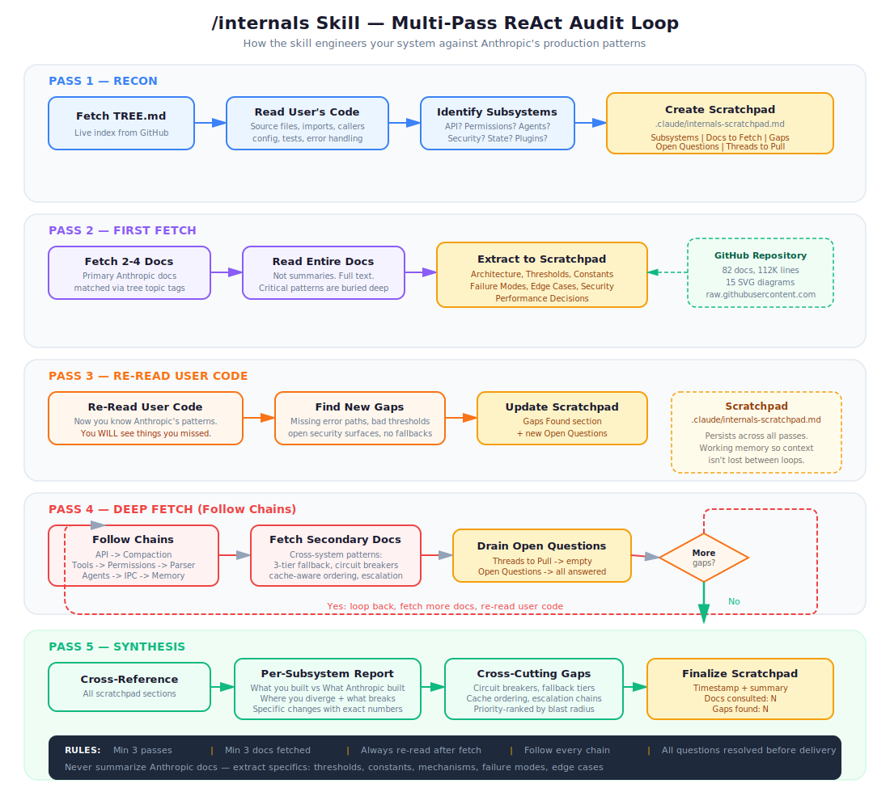

# Install: `/internals` Skill

A multi-pass deep audit skill. It reads your code, fetches Anthropic's production patterns, builds a scratchpad to think across passes, re-reads your code with new knowledge, follows chains across subsystems, and doesn't stop until every question is answered.

## Install

```bash
mkdir -p ~/.claude/skills/internals && curl -sL \
  https://raw.githubusercontent.com/thtskaran/claude-code-analysis/master/.claude/skills/internals/SKILL.md \
  -o ~/.claude/skills/internals/SKILL.md
```

That's it. Works across all your projects.

## How It Works

The skill runs a **multi-pass ReAct loop**, not a one-shot analysis:



**Pass 1 — Recon:** Fetches the live `TREE.md` index from GitHub. Reads your source files — not just the file you pointed at, but imports, callers, config, tests, error handling. Creates a scratchpad at `.claude/internals-scratchpad.md` with sections for subsystems, docs to fetch, gaps, open questions, and threads to pull.

**Pass 2 — First Fetch:** Pulls 2-4 primary Anthropic docs matched by topic tags. Reads them fully — critical patterns are buried deep. Extracts specifics to the scratchpad: thresholds, constants, failure modes, security boundaries, edge cases, performance decisions. Not summaries. Exact mechanisms.

**Pass 3 — Re-Read:** Goes back to your code with new knowledge. You always see things you missed the first time: error paths Anthropic handles that you don't, thresholds you hardcoded wrong, security surfaces left open, resilience mechanisms that don't exist in your code. Updates the scratchpad with new gaps and open questions.

**Pass 4 — Deep Fetch:** Follows chains. API client has no context management? Fetches the compaction doc. Permission model is flat? Fetches both the YOLO classifier and bash parser docs. Looks for cross-system patterns (circuit breakers, fallback tiers, escalation chains). Keeps fetching until the scratchpad has zero open questions.

**Pass 5 — Synthesis:** Delivers per-subsystem findings: what you built, what Anthropic built, where you diverge, what breaks without it, what to change (with exact numbers). Then cross-cutting gaps ranked by blast radius. Finalizes the scratchpad with a timestamp and summary.

## The Scratchpad

The skill creates `.claude/internals-scratchpad.md` in your project as persistent working memory. This is how it thinks across passes without losing context. It tracks:

- Subsystems identified in your code
- Anthropic docs fetched and patterns extracted
- Gaps between your implementation and production patterns
- Open questions that need more docs to answer
- Chains to follow (doc A references subsystem B, need to fetch doc C)

The scratchpad is left behind after the audit — you can reference it, share it, or use it as a checklist.

## What It Covers

Whatever subsystem you're building, there's an Anthropic pattern for it:

- **API clients** — 5-provider streaming, retry with jitter, cost tracking
- **Context management** — 3-tier compaction, 93% trigger, 9-section summary, circuit breakers
- **Security** — 2-stage AI classifier, bash parser blocking 15 AST types, sanitization maps
- **Agent systems** — leader-follower swarms, file-based IPC, permission brokering
- **Permissions** — 6 modes, 7-stage pipeline, denial escalation
- **Plugins** — 6-phase lifecycle, DFS deps, homograph detection
- **CLI/TUI** — custom React renderer, Yoga layout, packed cell buffers, frame diffing
- **Build systems** — 88 feature flags, dead code elimination
- **Prompts** — 20 techniques, cache boundaries, 7+13 section architecture
- **State management** — migrations, schema evolution, persistence
- **Telemetry** — 200+ events, sampling, PII classification
- **Error handling** — circuit breakers, fallback chains, token escalation

## Usage

The skill auto-triggers when Claude detects relevant subsystems in your code. Or invoke manually:

```
/internals
```

## Uninstall

```bash
rm -rf ~/.claude/skills/internals
```
